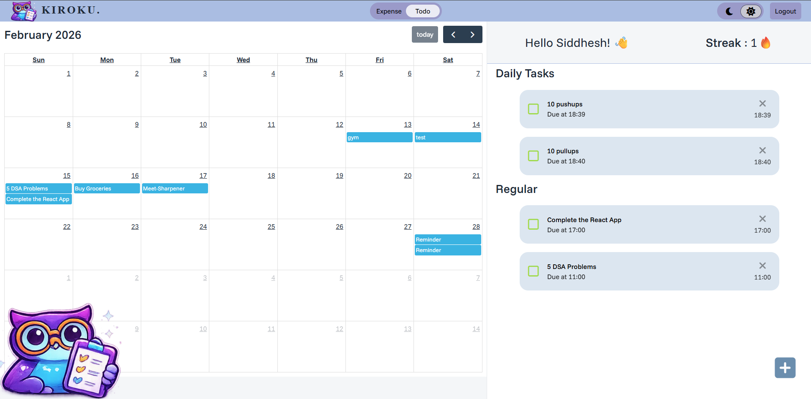
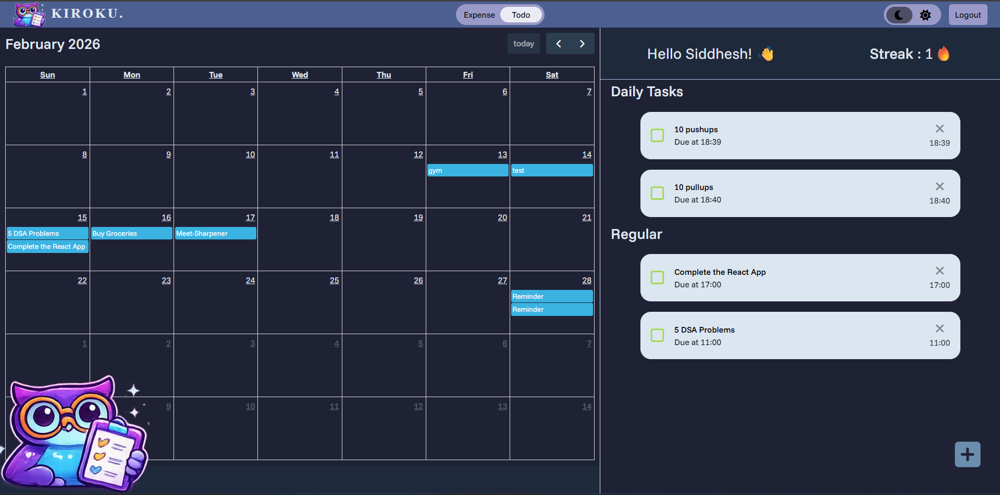
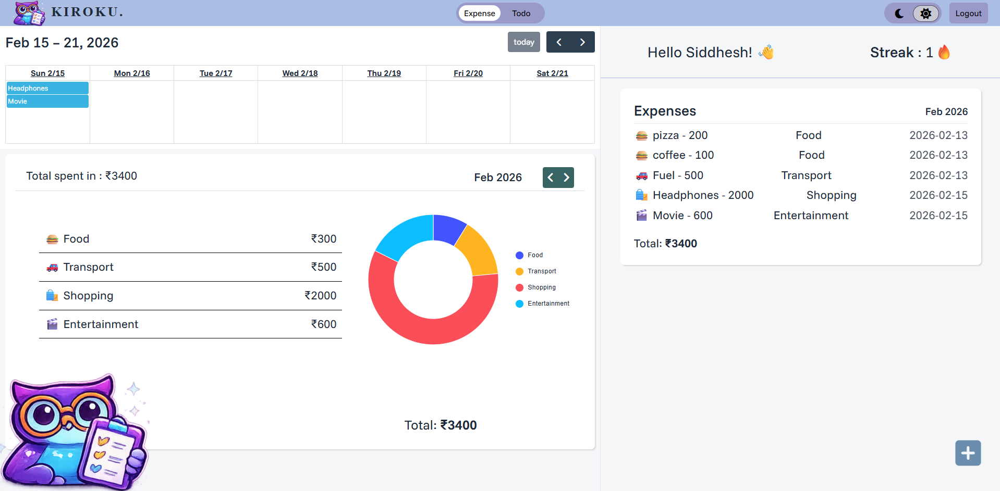
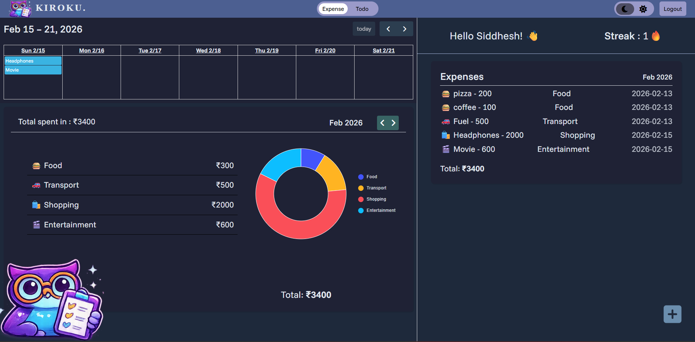
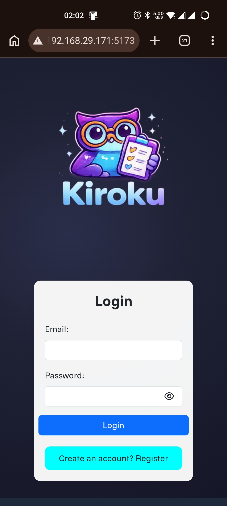
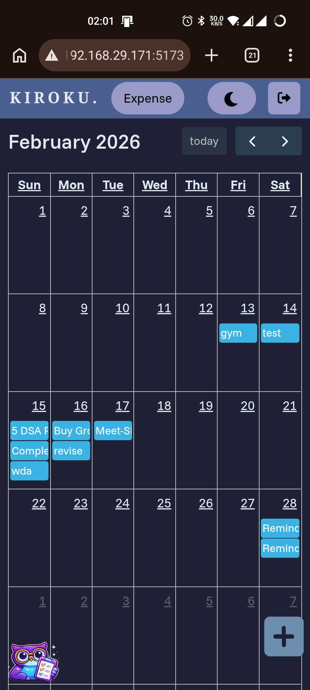
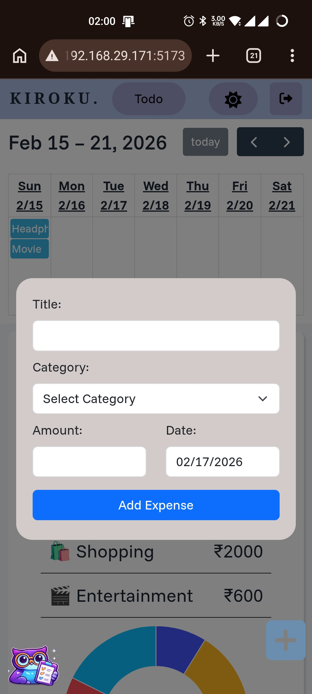
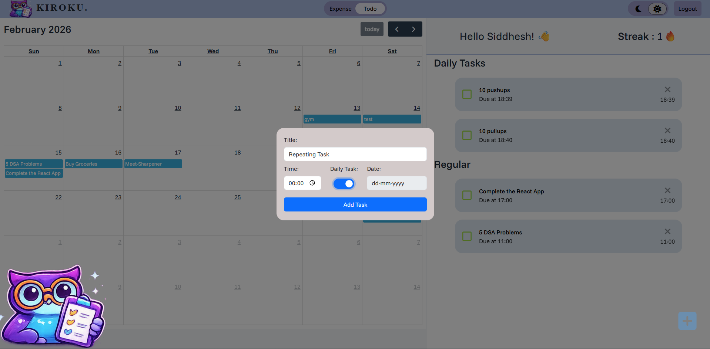
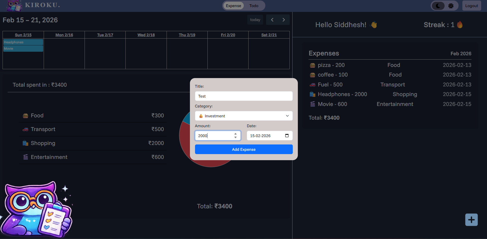
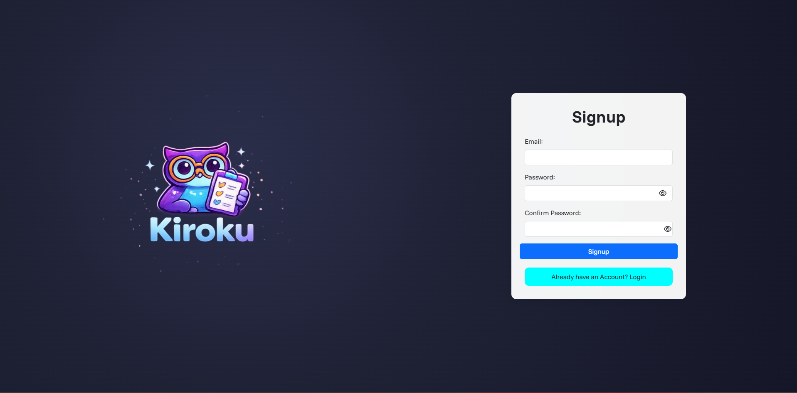

# 🦉 Kiroku

A minimal productivity dashboard to manage daily tasks and track monthly expenses — built with React, Redux Toolkit, and Firebase.

🌐 **Live Demo:** [Open Kiroku](https://daily-todos-c93cd.web.app/)

Kiroku (記録) means “record” in Japanese.
The app is designed with a clean, calm aesthetic focused on clarity and organization.

# 📸 Screenshots

## 🏠 Todo View

  
  

---

## 💰 Expense View

  

  
  

---

## 📱 Mobile View

  
  
  

---

➕ Additional Screens

 

## ✨ Features

### 📝 Todo Management
- Daily & regular tasks
- Overdue detection
- FullCalendar integration

### 💰 Expense Tracking
- Monthly filtering
- Category grouping
- Pie chart visualization

### 🔐 Authentication
- Signup & Login
- Persistent sessions
- Protected routes

### 🎨 UI
- Dark / Light mode
- Japanese minimal design
- Smooth animations

## 🛠 Tech Stack

- React (Vite)
- Redux Toolkit
- Firebase Realtime DB
- FullCalendar
- MUI Charts
- Framer Motion

## 🚀 Getting Started

### Install
npm install

### Run
npm run dev

Create a .env file:

VITE_FIREBASE_KEY=...
VITE_BASE_URL =...

## 🧠 Architecture Highlights

- Global theme management using Redux + CSS variables
- Async authentication using createAsyncThunk
- Custom hooks for task & expense filtering
- Reusable PageLayout pattern

## 🔮 Future Improvements

- Mobile responsiveness

## 👤 Author
Built by Siddhesh Soni

